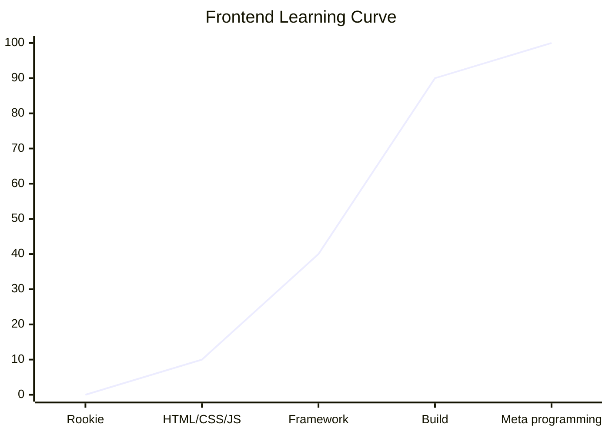

我一直很难向别人解释前端的复杂度，因为这是一个非常奇怪的曲线。  

它分为四个关键节点：HTML/CSS/JS、Framework、Build、Meta programming。

可以看到难度曲线在 Framework(框架) 和 Build(构建) 之间极速上升。

详细解释

具体来说，一个新手，在花 5 天的时间大体了解 HTML/CSS/JS 之后，开始学习 Vue，一个月之后，他可以完成一个简单的项目。

接下来他会花更多的时间，有可能是半年，也有可能是一年，去学习这个框架周边的生态，比如状态管理、路由、组件库、请求库，以及稍微深入一些的框架原理。

继续深挖，他会发现前端的半边天是构建工具，于是他开始学习 Rollup、ESBuild、Turbo 等工具，以及它们背后的设计思想。
还有 unplugin、unenv、ssr 等更小众的知识。这个过程又需要 1 年。

最后，他会理解前端的本质，就是基于 compile 和 monkey patch 的元编程，屠龙术已经在前面两个阶段学完了，最后就是一个参悟的过程。

如果你问我舒适圈在哪个节点，那我大概会说，在你学了 Vue、Solid、Svelte 中任何一个框架和一个组件库之后，就可以开摆了。

但你可能不想花费这么多时间，又想享受现代前端的好处，下面是我个人的一些推荐组合，按照复杂度的从小到大排列。

## 不需要打包的组合

- 响应式：petite-vue
- 样式：tailwindcss
- 组件库：daisyui

## 需要打包的组合

- 打包器：vite
- 框架：solid.js
- 组件库：element-plus
