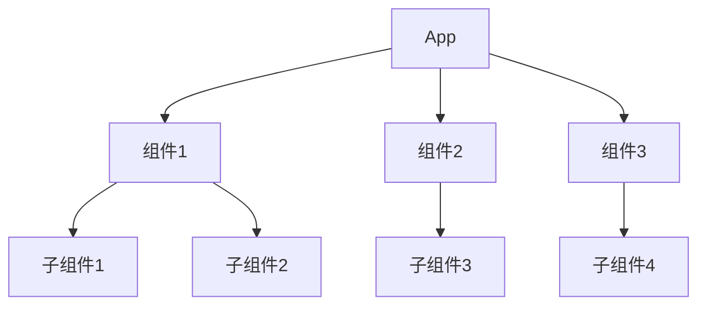
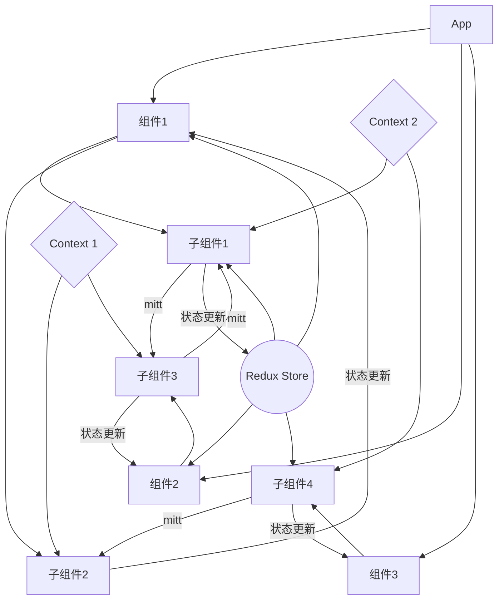

起因是我之前发布了一个「吹Vue 踩 React」的回答，有个兄弟发了这样一条评论。  

> 答主的回答过于绝对了吧，vite 在大型项目的冷启动其实挺慢的，而大多数人接触的大型项目比较少，react 重复请求的问题基本上调试一次就知道问题所在，react 好在生态比较好和jsx,我相信大部分人写完jsx 和 template 后还是会更倾向于jsx 的，vue 从2到3难倒了多少小公司，大部分都还在维护者多年前的vue 2+ element 无法直接升级，相比之下 react+antd 就好升级的多

我一向喜欢这种友好的讨论，恰逢周末没动力写代码，详细讲讲为什么在实践上讲，Vue 就是比 React 更好。  

## 重复渲染
很多人误解了我的意思，以为我说的是：
> 一次请求更新了 state_1, state_1 导致了 state_2的更新，state_2 又触发了某个不应该触发的 useEffect。  

这种情况当然不难解决，但React重复渲染的问题往往更严重。  
比如我们的老朋友 Github，每次 scroll 页面都会重复渲染元素。  

<video id="video" controls="" preload="none">
  <source id="mp4" src="https://r2.ray-d-song.com/2025/01/77a1ca2cf14445bbd9a2ec29cb4cfcf7.mp4" type="video/mp4"/>
</video>

> 视频来自于 [x@aidenybai](https://x.com/aidenybai)，他写的 [React Scan](http://react-scan.com) 很好用。
> 顺带一提，Github 在2024年的11月修复了这个问题。

所以有人说React 是个大厂用的，人不行不能怪工具，很明显这种论调是站不住脚的。  
不管是阿里、微软、Github还是Meta，他们的网页都存在重复渲染问题。  

理想状态下，React 应用的状态应该是一棵干净、清晰的单向流动树。  


但真实的项目中并不是这样。  
- 奇怪业务需求导致请求触发器的层层传递
- Context、Redux、Jotai之类的中央状态管理
- mitt 之类的信号发射库

这些东西让React应用的状态盘根错节，最终形成这样的产物：  


难道用Vue，状态树就不长这样吗？  
当然不是，但是Vue允许你这样，不如说，Vue应用就应该长这样。  
因为Vue组件骨子里的OOP和状态机，你可以选择让每个组件维护自己的状态，也可以像React一样，一切皆输入（prop）。  
关键在于，Vue实现这些一点都不hack。  

想象这一段React代码
```tsx
const ExpensiveComponent = memo(({ data, onUpdate }) => {
  // 防止函数重新创建导致不必要的重渲染
  const handleClick = useCallback(() => {
    onUpdate(data)
  }, [data, onUpdate])

  // 防止对象字面量导致不必要的重渲染
  const style = useMemo(() => ({
    backgroundColor: data.color,
    padding: '10px'
  }), [data.color])

  // 防止计算属性导致不必要的重渲染
  const processedData = useMemo(() => {
    return expensiveCalculation(data)
  }, [data])

  return (
    <div style={style} onClick={handleClick}>
      {processedData.map(item => (
        <span key={item.id}>{item.value}</span>
      ))}
    </div>
  )
})
```
在Vue中，只需要：
```vue
<script setup>
const props = defineProps(['data'])

// 计算属性自动缓存
const processedData = computed(() => {
  return expensiveCalculation(props.data)
})

// 方法不会导致组件重渲染
function handleClick() {
  emit('update', props.data)
}
</script>

<template>
  <div 
    :style="{ backgroundColor: data.color, padding: '10px' }" 
    @click="handleClick"
  >
    <span v-for="item in processedData" :key="item.id">
      {{ item.value }}
    </span>
  </div>
</template>
```

React 为了避免不必要重渲染，需要使用的各种优化手段：
- memo 防止父组件更新导致的重渲染
- useCallback 防止函数重新创建
- useMemo 防止对象字面量和计算结果重新生成

Vue 表示不需要这些优化：
- 方法默认就是稳定的引用
- 计算属性自动缓存
- 模板编译时自动优化更新
- 对象字面量不会导致重渲染问题
