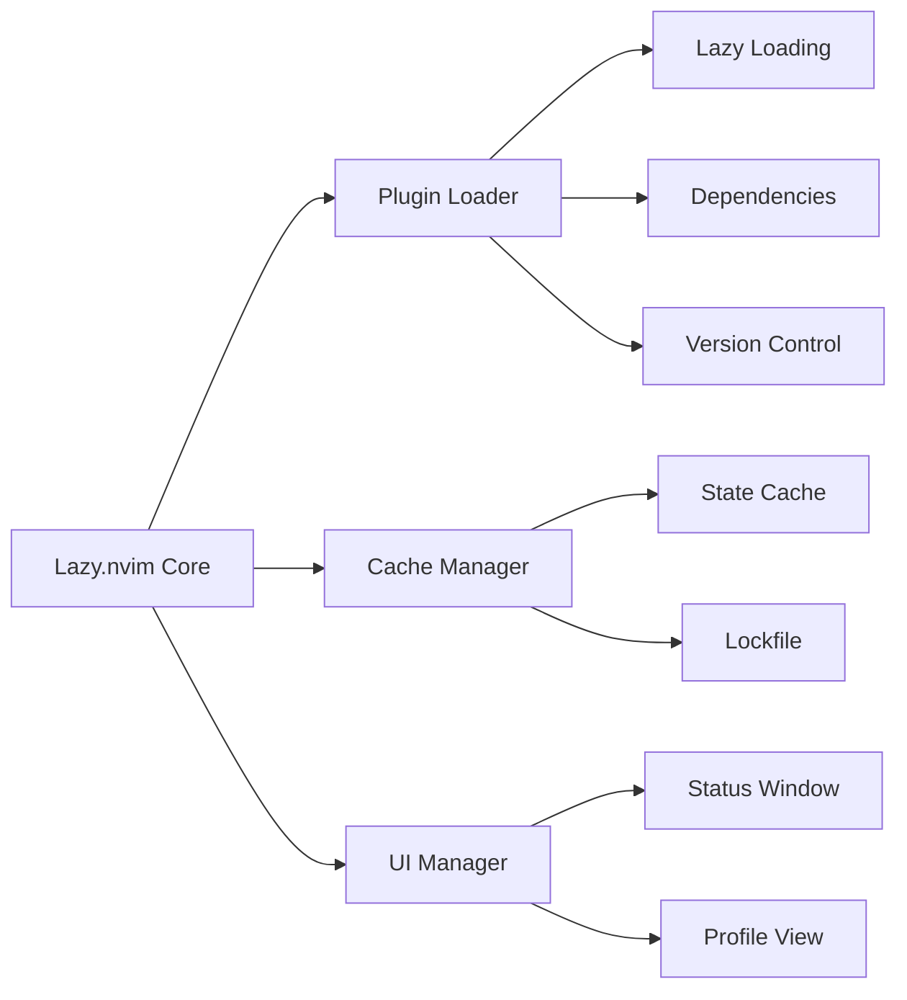

## 什么是 Neovim
Neovim 是一个基于 Vim 编辑器的现代化重构版本，它保持了 Vim 强大的文本编辑能力的同时，还带来了许多现代化的改进：  

- **内置终端模拟器** - 可以直接在编辑器中运行终端命令
- **异步执行** - 支持异步任务和作业控制，提供更流畅的使用体验
- **现代化的插件架构** - 使用 Lua 作为首选配置语言，提供更强大的插件 API
- **LSP 原生支持** - 内置语言服务器协议支持，提供代码补全、跳转等现代 IDE 功能

## Neovim 插件架构
Neovim 的插件系统本身提供了插件系统，不过缺少远程依赖管理，所以需要使用第三方插件管理器。  
第三方插件管理器经历了几次更迭，从最初的 `Vim-Plug` 到 `packer.nvim`，再到现在的 `lazy.nvim`。  
下面是 `lazy.nvim（后续简称 lazy）` 的架构图：

在 lazy 中，

lazy 及其插件完全由 Lua 编写，所以需要使用 Lua 语言进行开发。  

## Lua 语言
在开发插件前需要对 Lua 语言有基本的了解。  
Lua 是一个动态类型的脚本语言，语法和 JavaScript 类似，但比 JavaScript 更简单。  
### 变量声明
Lua 的变量不需要声明类型，直接使用 `=` 赋值即可。  
同时 Lua 的变量默认是全局变量，使用 `local` 关键字声明局部变量。
```lua
a = 1 -- 全局变量
local b = "hello" -- 局部变量
```
### 函数声明
Lua 的函数声明使用 `function` 关键字，使用 `return` 关键字返回。  
和变量声明一样，Lua 的函数默认是全局函数，使用 `local` 关键字声明局部函数。
```lua
local function add(a, b) -- 局部函数
    return a + b
end

function main() -- 全局函数
  return "Hello, World!"
end
```
### 表
表是 Lua 唯一支持的高级数据类型，充当了其他语言中的数组、对象、字典等数据结构的角色。  
```lua
local table = {
  -- 表的键和值
  a = 1,
  b = "hello" -- 值的类型不必相同
}
```
Lua 中遍历表使用 `pairs` 函数，`pairs` 函数会返回表的键和值。
```lua
-- 遍历表
for key, value in pairs(table) do
  print(key, value)
end
```
### 闭包
闭包是 Lua 中的一种高级特性，可以理解为函数内部定义的函数。  
闭包可以访问外部函数的变量，即使外部函数已经执行完毕，保证其不会被垃圾回收。
```lua
local function outer()
  local a = 1
  return function()
    return a
  end
end

local inner = outer()
print(inner()) -- 输出 1
```

上面就是 Lua 语言的基本语法，更多细节可以参照[菜鸟教程](https://www.runoob.com/lua/lua-tutorial.html)或[官方文档](https://www.lua.org/manual/5.4/)。  
下面我们开始开发插件。

## Lazy 插件开发
### 目录结构
Lazy 插件有一套约定的目录结构:
```bash
.
├── LICENSE
├── plugin
│  └── plugin-file.lua
├── lua
│  └── main-file.lua
└── README.md
```
插件的主体是 `plugin` 和 `lua` 文件夹。  
- `plugin` 文件夹下的代码会在 Neovim 启动时立即执行，如果要注册 keymaps 或 autocommands，一般在这里进行。
- `lua` 文件夹通常是存放插件代码的地方，这些代码只有在用户明确要求加载插件时才会执行。

### 实现目标
因为我总是忘记自己设置的快捷键，所以编写一个根据输入提示找到快捷键的插件。  
具体来说，输入`:Prompt <提示词>`，插件会根据提示词找到对应的快捷键并打印出来。  

## 思路
我们需要

# 参考
- [Lazy.nvim 文档](https://lazy.folke.io/)
- [如何用 Lua 编写一个 neovim 插件 --- How to write a neovim plugin in lua](https://miguelcrespo.co/posts/how-to-write-a-neovim-plugin-in-lua/)
